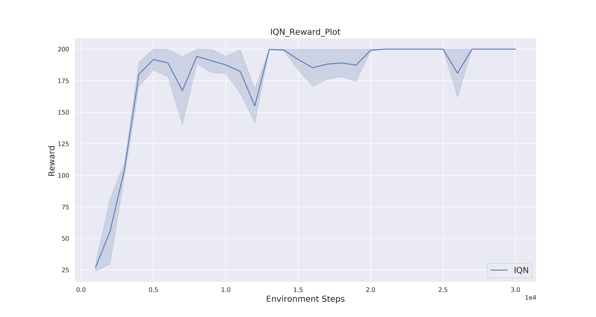
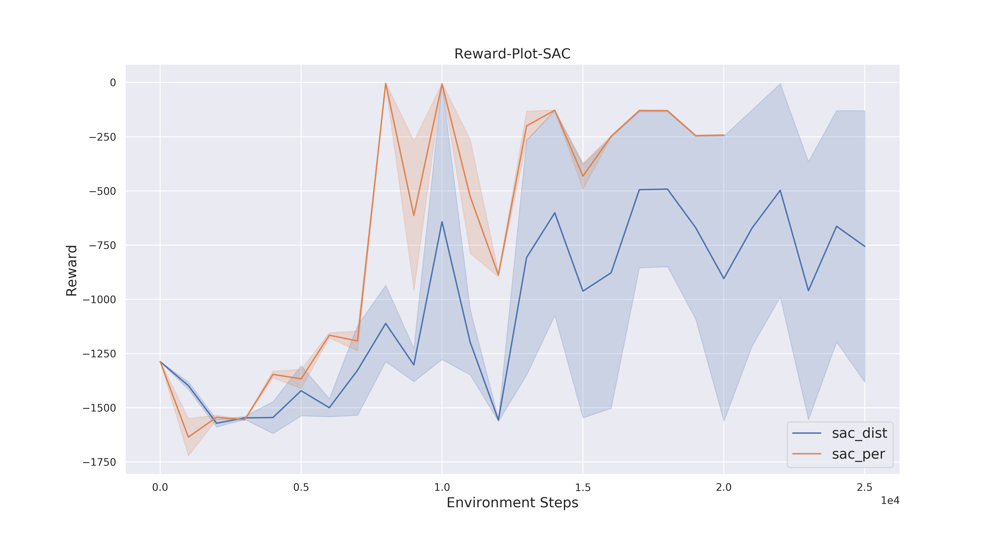
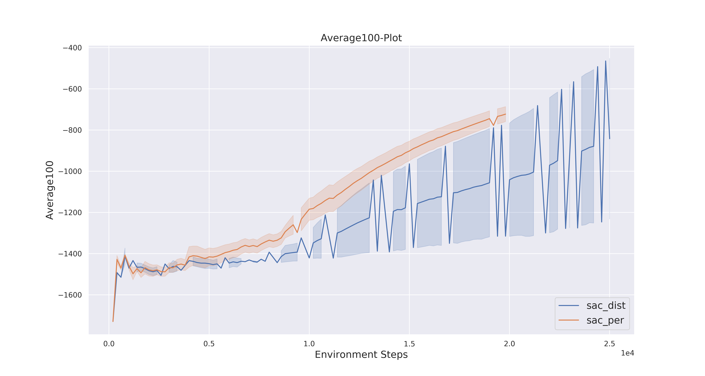

# Tensorboard-Plotting
The plotting script allows you to plot different training runs directly from the tensorboard logdir.
 
#### Install Requirements

`pip install -r requirements.txt`

## How to use
See possible inputs:
`python plotting.py -h`

Following two examples of how you can use the plotting script. 

** Imaginary training runs are included in this repo so you can enter the exact commands to get the example results ** 
### Example 1:
You have trained the IQN algorithm on an training environment for two different seed and now you want to plot the reward. The both runs are called **cp_w1** and **cp_w4** and both are in the tensorboard logdir **runs**. 
To plot the results you simply type in the console: 

'python plotting.py --algorithm IQN -dir runs/cp_w1 runs/cp_w4 --label Reward --title IQN_Reward_Plot'

#### **Output:**

### Example 2:
It is also possible to compare two different algorithms on different labels. Lets say you trained SAC with a distributional Critic (sac_dist) and SAC with Prioritized Experience Replay (sac_per). Now you want to compare both algorithms based on the Reward and Average100 labels. To plot those results you type the following in the console:
 
`
python plotting.py --algorithm sac_dist sac_per --label Reward Average100 -dir runs/sac_dist1/ runs/sac_dist2/ runs/sac_per1/ runs/sac_per2/ --title Reward-Plot-SAC Average100-Plot
`

#### **Outout:**

 
